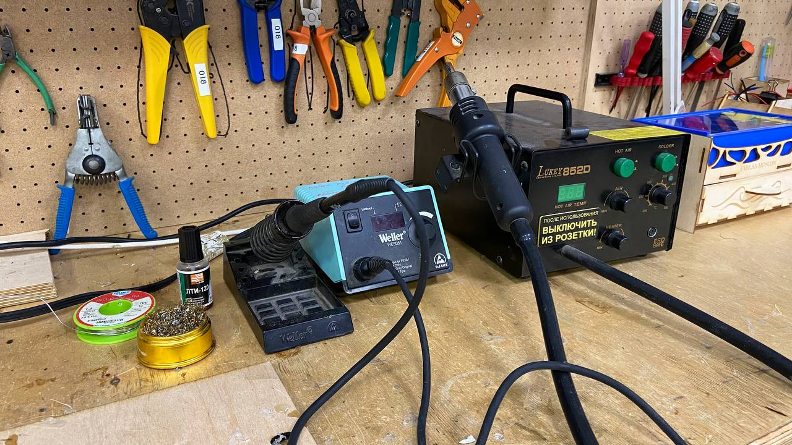
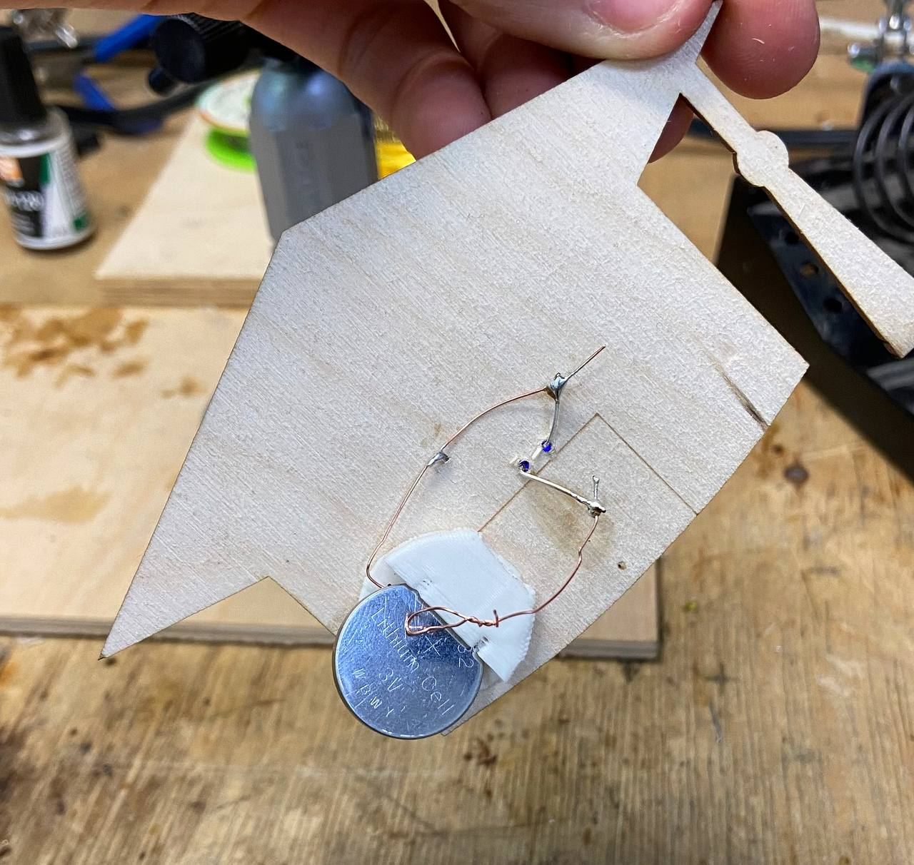

**Оборудование :**

— 3D-принтер Prusa i3 MK3 (для держателя  батарейки);

— Лазерный гравер GCC Spirit GLS100 (для мантии);

— Сверлильный станок Bosch PBD 40 (для сверление отверстию); 

— Паяльник (для электрический часть)

*Ход работы :*

1.Мантия был нарисован с помощью CorelDraw с специальными отверстиями для светодиодных ламп  

2.Модель держателя  батарейки была взята из сервиса [Thingiverse](https://www.thingiverse.com/) и обработана в программе PrusaSlicer

3.Из фанера с толщиной 3мм была вырезана форма мантии а держатель напечатан на 3D-печати 

4.В электрическом части медные проводы были спаяны с помощью припоя от батарейки к светодиоду 
